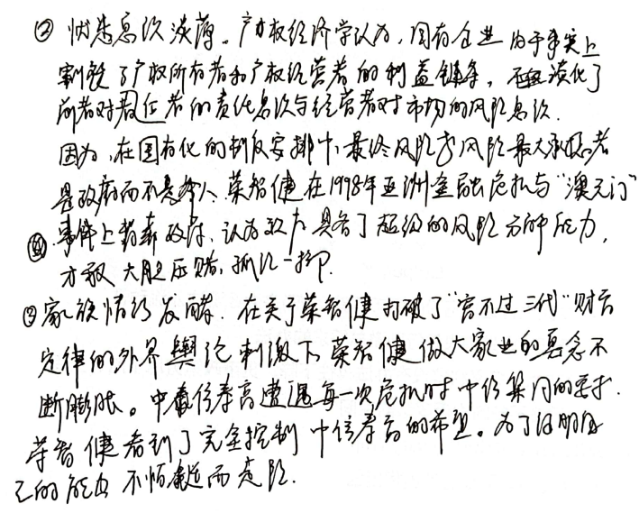

# 金工期末题

## 1. 请回忆中航油陈久霖先生的故事，你认为可以从中学到什么？

### （1）卖出看涨期权与买入看跌期权

有不少人认为，中航油应该买入看跌期权，因为他不看涨，就意味着看跌。卖出看涨期权与买入看跌期权的区别之一在于：买入看跌期权一般认为未来价格会有较大的下跌；而卖出看涨期权认为未来价格不会有大的下跌。在本案中，即便买入5200万桶看跌期权，也一样亏损，只不过作为买方风险不会进一步扩大。
更重要的是，卖出期权是收取权利金，帐面是收入，即便价格上涨亏损也是虚亏；而买入期权是支付权利金，一旦成交，帐面就是支出。

### （2）中航油没有落实内控制度

中航油其实有严格的内控制度，但没有执行。
中航油内部有严格的交易制度：每位中航油期货交易员，每笔交易损失20万美元以上时，继续交易与否要提交给公司的风险管理委员会评估；累计损失超过35万美元的交易必须得到总裁的同意才能继续；任何将导致50万美元以上损失的交易将自动平仓。换句话说，中航油10位交易员的损失额上限本来只有500万美元，最终却损失5.5亿美元，110倍，或者说有110次的斩仓机会。
一根火柴的价值只有一分钱，但是它能毁掉价值千万的大厦。
建立一个成功的企业需要长年的努力，而毁掉它，只需要一个错误的决策。

### （3）缺乏风险管理意识

国内绝大部分企业普遍缺乏风险管理意识。
投机的同时，缺乏相应的控制手段，内控方面出现严重问题。
期货市场绝对可以帮助企业控制风险而不是放大企业的风险，只有在不当使用的情况下才会放大企业的风险，给企业经营带来危险甚至导致企业的破产。加强内部控制是首当其冲的事情。

### （4）赌徒心理

越输越赌，越赌越输。
赌博中输的人，一般会丧失理性，越丧失理性决策就越草率，越草率就越输，越输就越想反本。这种现象的存在对公司的风险管理是一种威胁。在国外，很多金融机构包括非金融企业，之所以在期货等金融交易过程中要进行平仓等强制性的措施，对实际损失宁可制定一个上限，也绝不会采取“博一把可能就赚回来”的做法，实际上也正是基于人性的这一弱点的考虑。

## 2. 请回忆香港在97年金融危机中遇到的各种问题，回答你从中学到了什么？

### （1）货币一次性大幅贬值往往是危机的开端

亚洲金融危机中，泰国一次性贬值的教训提示我们，认为一次性贬值策略可以解决问题太具有理想化色彩。在实践中，汇率波动往往会放大，预期非但不会因为一次性贬值而消退，反而使再一次贬值的预期更加强烈。一次性贬值很难达到所谓的理想中的合理水平，反而助长贬值大幅超出预期，造成难以挽回的后果。

### （2）增强资本流动可以，但重回资本管制需谨慎

建议一方面继续放开资本流入的管制，暂停进一步鼓励资本流出的措施，特别是严堵资本外流的非法和灰色渠道，如地下钱庄等，另一方面通过反洗钱和宏观审镇工具，如采取托宾税的方式，降低资金外流的压力，稳定市场预期。

### （3）政府干预市场需要对症下药
为防止亚洲金融危机重演，从各国应对危机的经验和教训来看，此时中国切勿采取一次性大幅贬值与资本管制的方式应对危机。相反，保持定力，稳定预期，加大与市场沟通仍然是防范金融危机的良方。

### （4）抓紧培植新的经济增长点
在加大对基础工业、能源和农业等投入的基础上，有选择的发展一些生物工程、海洋科技等高科技产业，抓紧培植新的经济增长点。

### （5）加强对金融系统的监管，对外逐步开放金融市场，建立健康、有序的金融市场。

## 3. 回忆中信泰富荣智健先生的故事，回答你从中学到了什么？

### （1）缺乏群体决策
由于现代投资市场的高风险以及决策规范化和民主化的要求，国际上许多大型金融企业都实行群体决策制度，如董事会制、委员会制等。但是，对于一个组织而言如果高层管理者中存在一个特殊人物，群体决策就会陷入少数人统治的境地。

## 5. 认真阅读 十四五规划 中国制造2025等规划性文件，请在此基础上判断什么产业有较大的发展空间，结合自身特点，阐述你应该如何从这些产业中获得价值？
新一代信息技术、生物技术、新能源、新材料、高端装备、新能源汽车、绿色环保以及航空航天、海洋装备，生物技术和信息技术融合创新，生物医药、生物育种、生物材料、生物能源等产业，生物经济。

新一代信息技术产业。
集成电路及专用装备。着力提升集成电路设计水平，不断丰富知识产权（IP）和设计工具，突破关系国家信息与网络安全及电子整机产业发展的核心通用芯片，提升国产芯片的应用适配能力。掌握高密度封装及三维（3D）微组装技术，提升封装产业和测试的自主发展能力。形成关键制造装备供货能力。
